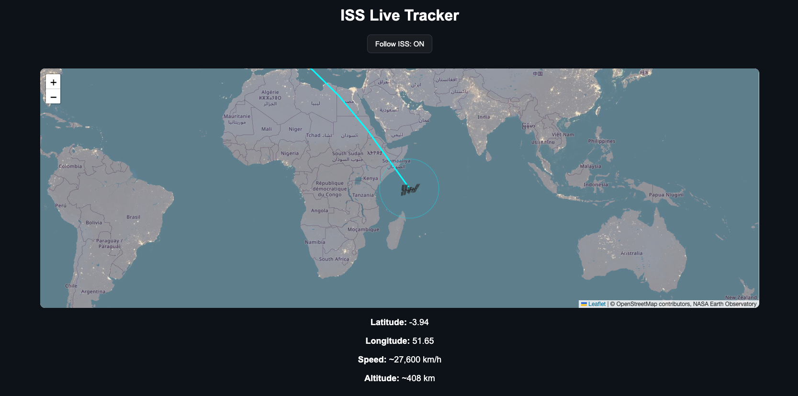

# ★ ISS Live Tracker

## Preview


A real-time web app that tracks the International Space Station (ISS) using live satellite data and displays its position, speed, and visibility radius on an interactive world map.


## Features
-  Interactive world map
-  Live ISS position updates every 5 seconds
-  ISS marker with custom icon
-  Latitude and longitude display
-  NASA night lights overlay
-  "Follow ISS" toggle mode
-  Visibility radius around ISS
-  Recent orbit trail

## Technologies Used
- HTML
- CSS
- JavaScript
- Leaflet.js (map library)
- OpenStreetMap tiles
- NASA GIBS night lights layer
- WhereTheISS.at API

## How to Run
1. Download the files
2. Open the project folder in terminal
3. Run a local server:
   ```bash
   python3 -m http.server
